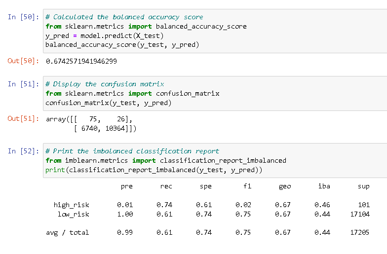
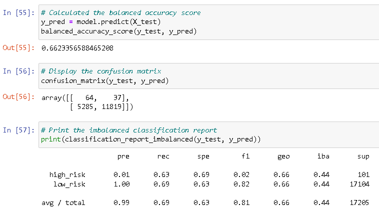
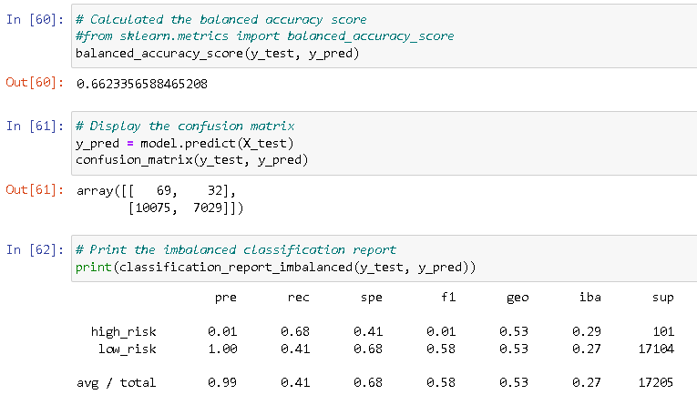
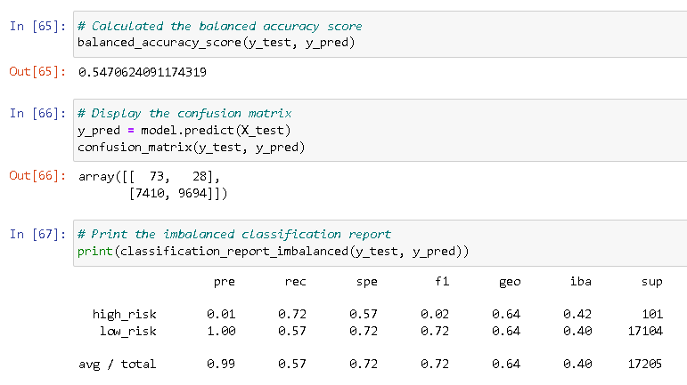
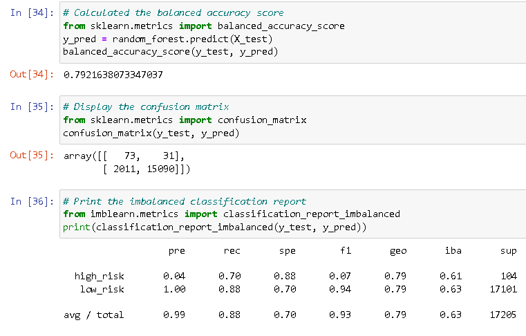
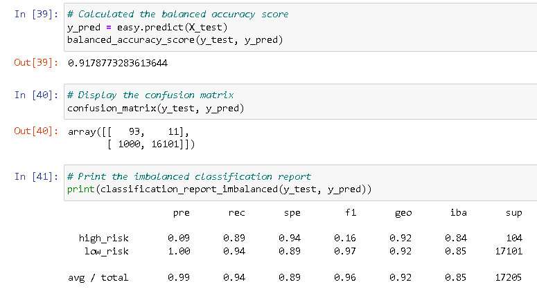
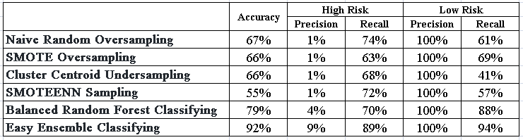

# Credit_Risk_Analysis

## I. Overview of Project

### Background
Fast Lending, a peer to peer lending services company, wants to use machine learning to predict credit risk. We are tasked to build and evaluate several machine learning models or algorithms to prdeict credit risk.

### Objective
Now, we are to apply machine learning to solve a real-world challenge: credit card risk. We’ll need to employ different techniques to train and evaluate models with unbalanced classes to evaluate the performance of these models and recommend whether they should be used to predict credit risk.

## II. Results

### A. Naive Random Oversampling

### B. SMOTE Oversampling

### C. Cluster Centroid Undersampling

### D. SMOTEENN Sampling

### E. Balanced Random Forest Classifying

### F. Easy Ensemble Classifying

## III. Summary

From the 6 Analyses:

